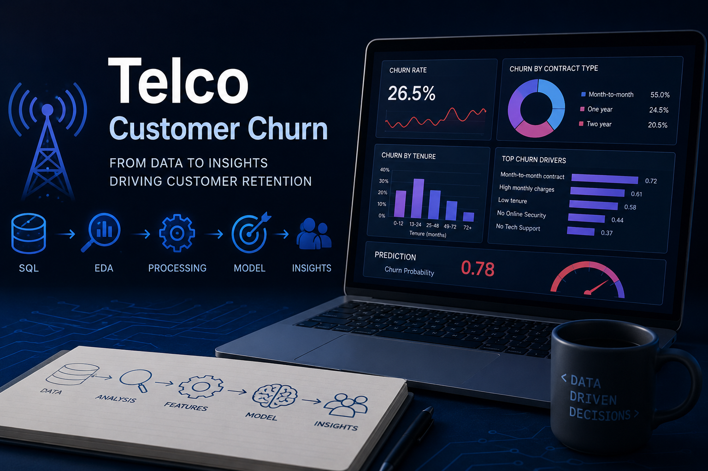

# Telco Churn Risk Scoring

  

## 🎯 Project Goal

The goal of this project is to build a machine learning classification model that identifies existing customers with a high risk of churn.

In addition to predicting churn risk, the project aims to rank customers using a `priority_score` based on the model's estimated churn probability and the customer's monthly charges. This score is intended to help a retention team prioritize customers whose churn may have a higher business impact.

Because the dataset is static, this project should be treated as an educational prototype, not as a production-ready churn prediction system.

## 📊 Dataset
Name: Telco Customer Churn

Source: [Telco Customer Churn](https://www.kaggle.com/datasets/blastchar/telco-customer-churn)

Important:
- The dataset files are owned by their original authors and are used in this project for educational and portfolio purposes only.

- The raw dataset is not redistributed in this repository.

- To reproduce the project, download the dataset from Kaggle and place the CSV file in: `data/raw/`

## 🚧 Project Status
In progress – early stage.

## 🔜 Next Step

The next step is to perform initial business and data exploration using SQL:

- Data Overview
- Churn rate analysis
- Customer segments analysis

## 👨‍💻 Author

Michał Ryzio